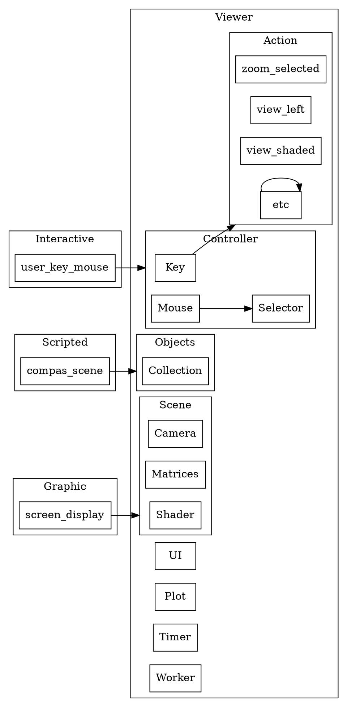

## Concept

1. Mapping the file: The structure should logically map the `.viewer`.

## Quick Look

## Structure

    Plot -> UI
    Shader -> cluster_Scene
    cluster_Objects -> cluster_Scene
    c -> g [ltail=Selector,lhead=cluster_Scene];
    cluster_Action -> cluster_Scene
    Mouse -> cluster_Scene
