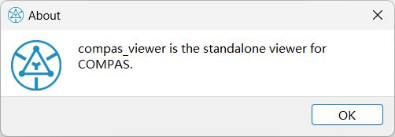

*******************************************************************************
Windows Messages
*******************************************************************************

.. autosummary::
    :toctree:
    :nosignatures:

Launch the Viewer
==============================================================================
Lunching the viewer is as simple as importing it and calling the ``Viewer`` class:

.. code-block:: python

    from compas_viewer import Viewer

    viewer = Viewer()
    viewer.show()

You can add window pop-up messages to your viewer using the following methods.

"About" Level Message
==============================================================================
To display "about" message from the configuration file:

.. code-block:: python

    viewer.about()

"Info" Level Message
==============================================================================
To display "info" message:

.. code-block:: python

    viewer.info("This is an info message.")

.. image:: ../../_images/info.jpg

"Warning" Level Message
==============================================================================
To display "warning" message:

.. code-block:: python

    viewer.warning("This is a warning message.")

.. image:: ../../_images/warning.jpg

"Critical" Level Message
==============================================================================
To display "critical" message:

.. code-block:: python

    viewer.critical("This is an error message.")

.. image:: ../../_images/critical.jpg

"Question" Level Message
==============================================================================
To display "question" message:

.. code-block:: python

    viewer.question("This is a question message.")

.. image:: ../../_images/question.jpg

"Confirm" Level Message
==============================================================================
To display "confirm" message:

.. code-block:: python

    viewer.confirm("This is a confirmation message.")

.. image:: ../../_images/confirm.jpg
